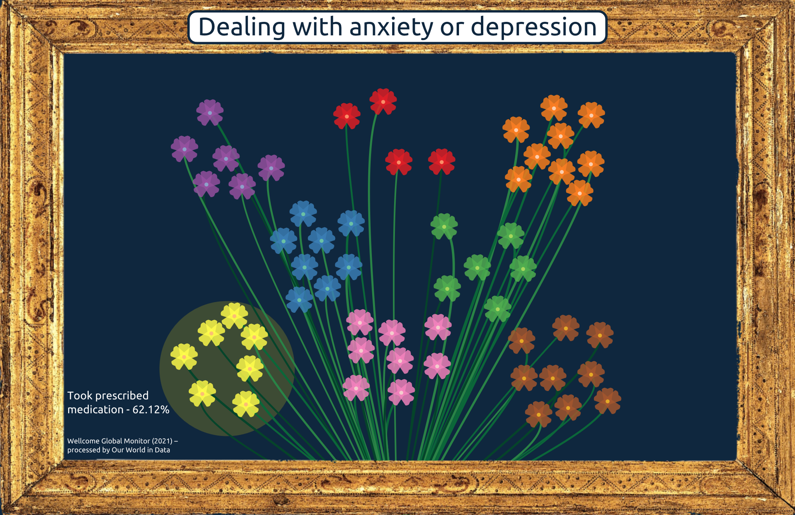

# Dealing with anxiety or depression

This data visualization illustrates the various methods Italians use to deal with anxiety or depression. Each method is represented by a group of Achillea flowers, symbolizing the wish for a quick healing. 

The interactive visualization can be tried [here](https://cocuma22.github.io/Healing_bouquet/).

**Data source**: *Wellcome Global Monitor (2021) – processed by Our World in Data. “Engaged in religious/spiritual activities” [dataset]. Wellcome Global Monitor (2021) [original data].*

More information on the dataset used can be found at this [link](https://ourworldindata.org/grapher/dealing-with-anxiety-depression-approaches). 
